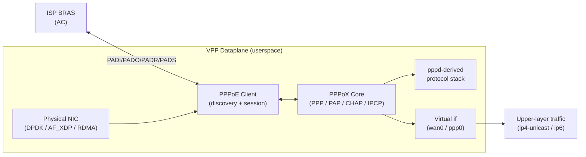

# 🚀 VPP PPPoE Client Plugin

[](https://github.com/Hi-Jiajun/vpp-pppoeclient/stargazers)
[](https://github.com/Hi-Jiajun/vpp-pppoeclient/network/members)
[](https://github.com/Hi-Jiajun/vpp-pppoeclient/releases/latest)
[](./LICENSE)

> 为 [FD.io VPP](https://fd.io/) 数据面设计的用户态 PPPoE 客户端插件。
> 在 VPP 的高性能 vectorized packet processing 基础上完整实现 RFC 2516 PPPoE
> 发现/会话生命周期、PAP/CHAP 认证、IPv4/IPv6 地址协商，单进程可管理大量并发 PPPoE 会话。

🌏 [English README](./README_EN.md)

---

## ✨ 核心特性

- **用户态原生实现**：完全跑在 VPP 数据面，避开传统 `pppd` + kernel tunnel 的 context switch 开销
- **单插件整合**：PPPoE 发现、PPPoX 控制面、PAP/CHAP 认证、IPCP/IPv6CP 协商合并为 `pppoeclient_plugin.so`
- **多实例并发**：每个 PPPoE 会话用独立 `sw-if-index` 虚拟接口承载，支持同时跑多路拨号
- **可观测性丰富**：`show pppoe client history` / `show pppoe client summary` 暴露每条会话的状态机迁移 + 关键事件
- **退避与抖动**：PADI 重试自带 backoff-jitter，避免大量客户端同时重连时的风暴
- **接口命名可控**：`wan0`、`ppp0` 之类业务语义名称可由运维指定，不局限于 VPP 自动分配的 `pppox0`

## 🏗️ 架构



- `pppoeclient_plugin.so` 单一 shared library，加载即启用所有能力
- PPPoX 核的 PAP/CHAP/LCP/IPCP 来自 `pppd` 的协议实现，移植到 VPP graph node 模型下
- 控制平面和数据平面在同一 VPP worker 里，数据包零拷贝

## 🚀 Quick Start

### 1. 获取预编译包

从 [Releases](https://github.com/Hi-Jiajun/vpp-pppoeclient/releases/latest) 下载你发行版对应的包：

| 发行版 | 包格式 | 架构 |
|---|---|---|
| Ubuntu 24.04 | `.deb` | amd64 |
| Debian 12 | `.deb` | amd64 |
| Fedora 43 | `.rpm` | x86_64 |
| Rocky Linux 9 / RHEL 9 | `.rpm` | x86_64 |

包命名格式：`vpp-pppoeclient-plugins-<vpp_ref>-<distro>.<arch>.{deb,rpm}`，
其 `<vpp_ref>` 是 Release tag 里标注的 FD.io VPP 官方 stable tag。

### 2. 安装

```bash
# Debian / Ubuntu
sudo apt install ./vpp-pppoeclient-plugins-v26.02-ubuntu24.04.amd64.deb

# Fedora / Rocky / RHEL
sudo dnf install ./vpp-pppoeclient-plugins-v26.02-fedora43.x86_64.rpm
```

预编译包依赖与 Release tag 对应的 FD.io VPP 官方版本，请先安装匹配版本的 `vpp` / `vpp-plugin-core`。

### 3. 起一条 PPPoE 拨号

假设物理口是 `GigabitEthernet0/8/0`，ISP 提供用户名 `user@isp` + 密码 `secret`：

```bash
vppctl

# 创建 PPPoE 客户端，绑定物理口；返回 sw-if-index（假设为 5）
vpp# create pppoe client GigabitEthernet0/8/0 host-uniq 1

# 设置认证及其它会话参数（MTU / 默认路由 / peer DNS 等按需）
vpp# set pppoe client 5 username user@isp password secret use-peer-dns add-default-route

# 观察会话状态
vpp# show pppoe client
vpp# show pppoe client history
vpp# show pppoe client detail
```

上层运维操作都走 `create pppoe client` / `set pppoe client` / `show pppoe client ...` 这套 `pppoe client` 命名空间的 CLI；插件内部再驱动 `pppox` 控制面完成 LCP / PAP / CHAP / IPCP 协商，运维层面不需要直接碰 `pppox` 命令。

完整 CLI 见源代码 [`pppoeclient.c`](https://github.com/Hi-Jiajun/vpp-pppoeclient/blob/master/pppoeclient.c)（`set pppoe client` 支持 `ac-name`、`service-name`、`username`、`password`、`mtu`、`mru`、`timeout`、`use-peer-dns`、`add-default-route{,4,6}`、`source-mac` 等参数）。

## 🧱 从源码编译

插件源码与 FD.io VPP 的 `src/plugins/` 目录布局一致，可以直接叠放到任意 VPP 检出树里编译：

```bash
# 假设已有 FD.io VPP 源码树在 ~/src/vpp
git clone -b master https://github.com/Hi-Jiajun/vpp-pppoeclient.git
rsync -a vpp-pppoeclient/ ~/src/vpp/src/plugins/pppoeclient/

cd ~/src/vpp
make install-dep
make build-release VPP_EXTRA_CMAKE_ARGS='-DVPP_PLUGINS="ppp,pppoeclient"'
```

构建产物 `build-root/.../vpp_plugins/pppoeclient_plugin.so` 即可被 VPP 加载。

或者参考本仓 [`scripts/build-binary-packages.sh`](./scripts/build-binary-packages.sh) 的 `fpm` 打包流程，一键出 deb/rpm。

## 🗂️ 仓库结构

这个仓库使用**双分支布局**分离"发布产物"和"代码历史"：

| 分支 | 内容 | 作用 |
|---|---|---|
| `main`（当前） | README、LICENSE、打包脚本、GitHub Actions workflows | 仓库门面 + 发布工具链 |
| [`master`](https://github.com/Hi-Jiajun/vpp-pppoeclient/tree/master) | **插件源代码本身**（根目录就是 `CMakeLists.txt`、`pppoeclient.c`……） | 完整开发历史，commit 对齐上游 vpp fork |

**想看真正的代码?请切到 [`master` 分支](https://github.com/Hi-Jiajun/vpp-pppoeclient/tree/master)** ——
那里每个 commit 都是在上游 `Hi-Jiajun/vpp@feat/pr-pppoeclient` 分支上开发 pppoeclient 时留下的真实足迹。

## 🔄 与上游 VPP 的关系

插件在 [Hi-Jiajun/vpp@feat/pr-pppoeclient](https://github.com/Hi-Jiajun/vpp/tree/feat/pr-pppoeclient/src/plugins/pppoeclient) 中持续开发，该分支也是向 FD.io Gerrit 上游 review 的工作分支。

本仓 `master` 分支通过 GitHub Actions workflow [`mirror-from-upstream.yml`](./.github/workflows/mirror-from-upstream.yml) 每日自动：

1. Clone 上游 `Hi-Jiajun/vpp@feat/pr-pppoeclient`
2. 运行 `git subtree split --prefix=src/plugins/pppoeclient`，提取只含插件子树的 commit 历史
3. 若上游有更新，force-push 至本仓 `master`，并触发 [`auto-release.yml`](./.github/workflows/auto-release.yml) 矩阵打包发新 Release

**结果**：`master` 分支的 commit 历史 = 在 vpp fork 里开发 pppoeclient 的真实 commit 序列，
author、date、message 与上游一致。

## 📜 License

代码主体 [Apache-2.0](./LICENSE)。

PPPoX 核内的 pppd 派生文件保留原始 BSD / mixed 协议，
参考 [`THIRD_PARTY_LICENSES.md`](./THIRD_PARTY_LICENSES.md) 与 master 分支 `pppox/pppd/` 下各文件头。

---

<sub>Built on top of [FD.io VPP](https://fd.io/). Not an FD.io official project.</sub>
