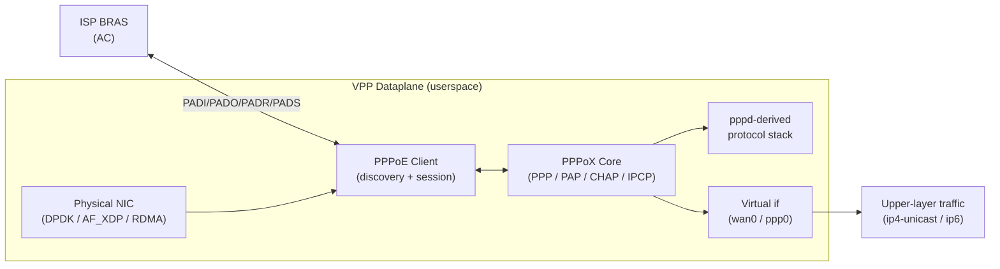

# 🚀 VPP PPPoE Client Plugin

[](https://github.com/Hi-Jiajun/vpp-pppoeclient/stargazers)
[](https://github.com/Hi-Jiajun/vpp-pppoeclient/network/members)
[](https://github.com/Hi-Jiajun/vpp-pppoeclient/releases/latest)
[](./LICENSE)

> A userspace PPPoE client plugin for the [FD.io VPP](https://fd.io/) dataplane.
> Implements RFC 2516 discovery, session lifecycle, PAP/CHAP authentication,
> and IPv4/IPv6 address negotiation on top of VPP's vectorized packet
> processing — a single process can drive many concurrent PPPoE sessions.

🌏 [中文 README](./README.md)

---

## ✨ Highlights

- **Userspace-native**: runs entirely inside the VPP dataplane, avoiding the context-switch overhead of the classic `pppd` + kernel tunnel design
- **Single consolidated plugin**: PPPoE discovery, the PPPoX core, PAP/CHAP, IPCP / IPv6CP are all shipped as one `pppoeclient_plugin.so`
- **Concurrent sessions**: every PPPoE session is carried by a dedicated `sw-if-index` virtual interface, so many dial-ups run in parallel
- **Observability**: `show pppoe client history` / `show pppoe client summary` expose per-session state machine transitions and key events
- **Backoff with jitter**: PADI retries use configurable jittered backoff to avoid reconnection storms
- **User-assignable interface names**: operators can pick business-meaningful names such as `wan0` / `ppp0` instead of the auto-assigned `pppox0`

## 🏗️ Architecture



- Single shared library `pppoeclient_plugin.so`; loading it enables every capability
- PAP / CHAP / LCP / IPCP are ported from `pppd` and rewired to run as VPP graph nodes
- Control plane and data plane share the same VPP worker — zero-copy all the way

## 🚀 Quick Start

### 1. Grab a prebuilt package

Pick a package for your distribution from [Releases](https://github.com/Hi-Jiajun/vpp-pppoeclient/releases/latest):

| Distro | Format | Arch |
|---|---|---|
| Ubuntu 24.04 | `.deb` | amd64 |
| Debian 12 | `.deb` | amd64 |
| Fedora 43 | `.rpm` | x86_64 |
| Rocky Linux 9 / RHEL 9 | `.rpm` | x86_64 |

Package naming: `vpp-pppoeclient-plugins-<vpp_ref>-<distro>.<arch>.{deb,rpm}` — the `<vpp_ref>` matches the FD.io VPP stable tag recorded in the Release title.

### 2. Install

```bash
# Debian / Ubuntu
sudo apt install ./vpp-pppoeclient-plugins-v26.02-ubuntu24.04.amd64.deb

# Fedora / Rocky / RHEL
sudo dnf install ./vpp-pppoeclient-plugins-v26.02-fedora43.x86_64.rpm
```

The package depends on a matching FD.io VPP runtime (`vpp` / `vpp-plugin-core`) for the same stable tag.

### 3. Bring up a PPPoE session

Assume the physical port is `GigabitEthernet0/8/0`, with credentials `user@isp` / `secret`:

```bash
vppctl

# Create a PPPoE client bound to a physical port; a sw-if-index is returned (assume 5)
vpp# create pppoe client GigabitEthernet0/8/0 host-uniq 1

# Configure auth and other per-session parameters (MTU / default route / peer DNS as needed)
vpp# set pppoe client 5 username user@isp password secret use-peer-dns add-default-route

# Inspect the session
vpp# show pppoe client
vpp# show pppoe client history
vpp# show pppoe client detail
```

All operator-facing actions live in the `pppoe client` CLI namespace — `create pppoe client` / `set pppoe client` / `show pppoe client ...`. The plugin drives the internal `pppox` control plane (LCP / PAP / CHAP / IPCP); operators do not need to touch `pppox` commands directly.

Full CLI surface is in [`pppoeclient.c`](https://github.com/Hi-Jiajun/vpp-pppoeclient/blob/master/pppoeclient.c) — `set pppoe client` accepts `ac-name`, `service-name`, `username`, `password`, `mtu`, `mru`, `timeout`, `use-peer-dns`, `add-default-route{,4,6}`, `source-mac`, etc.

## 🧱 Build from source

The plugin tree mirrors the FD.io VPP `src/plugins/` layout and can be dropped into any VPP checkout:

```bash
# Assuming an FD.io VPP checkout at ~/src/vpp
git clone -b master https://github.com/Hi-Jiajun/vpp-pppoeclient.git
rsync -a vpp-pppoeclient/ ~/src/vpp/src/plugins/pppoeclient/

cd ~/src/vpp
make install-dep
make build-release VPP_EXTRA_CMAKE_ARGS='-DVPP_PLUGINS="ppp,pppoeclient"'
```

The resulting `build-root/.../vpp_plugins/pppoeclient_plugin.so` is ready to be loaded by VPP.

Or reuse the `fpm`-based workflow in [`scripts/build-binary-packages.sh`](./scripts/build-binary-packages.sh) to produce deb/rpm directly.

## 🗂️ Repository layout

This repo uses a **two-branch layout** to separate packaging from code history:

| Branch | Content | Role |
|---|---|---|
| `main` (you are here) | README, LICENSE, packaging scripts, GitHub Actions workflows | Showcase + release toolchain |
| [`master`](https://github.com/Hi-Jiajun/vpp-pppoeclient/tree/master) | **The plugin source tree itself** (root contains `CMakeLists.txt`, `pppoeclient.c`, ...) | Complete development history, aligned with the upstream vpp fork |

**Want to read the actual code? Switch to the [`master` branch](https://github.com/Hi-Jiajun/vpp-pppoeclient/tree/master).** Every commit there is a real-world commit from developing pppoeclient on the upstream `Hi-Jiajun/vpp@feat/pr-pppoeclient` branch.

## 🔄 Upstream relationship

The plugin is developed on [Hi-Jiajun/vpp@feat/pr-pppoeclient](https://github.com/Hi-Jiajun/vpp/tree/feat/pr-pppoeclient/src/plugins/pppoeclient). That branch is also the working branch for upstreaming review on FD.io Gerrit.

The `master` branch here is maintained automatically by [`mirror-from-upstream.yml`](./.github/workflows/mirror-from-upstream.yml), which runs daily and:

1. Clones upstream `Hi-Jiajun/vpp@feat/pr-pppoeclient`
2. Runs `git subtree split --prefix=src/plugins/pppoeclient` to extract the plugin subtree with its history preserved
3. Force-pushes the result to `master` when new upstream commits exist, and then triggers [`auto-release.yml`](./.github/workflows/auto-release.yml) to build fresh prebuilt packages

**Net effect**: the `master` commit history equals the real sequence of commits made while developing the plugin on the vpp fork — author, date and commit message all preserved.

## 💖 Sponsor <sub>赞助</sub>

☕ If this plugin or the prebuilt packages helped you, feel free to buy me a coffee.  
<sub>如果这个插件或发布包帮到你，欢迎请我喝杯咖啡。</sub>


## 📜 License

The source code is licensed under [Apache-2.0](./LICENSE).

The pppd-derived files under the PPPoX core retain their original BSD / mixed licensing; see [`THIRD_PARTY_LICENSES.md`](./THIRD_PARTY_LICENSES.md) and file headers under `pppox/pppd/` on the master branch.

---

<sub>Built on top of [FD.io VPP](https://fd.io/). Not an FD.io official project.</sub>
